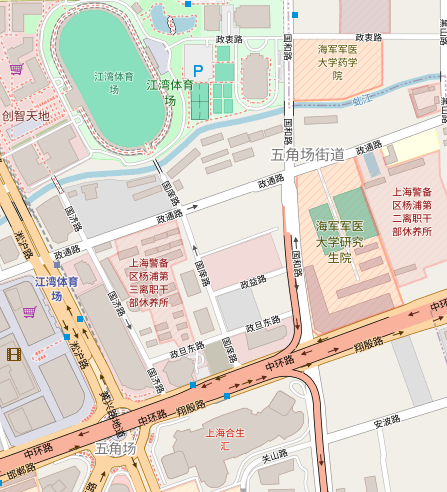
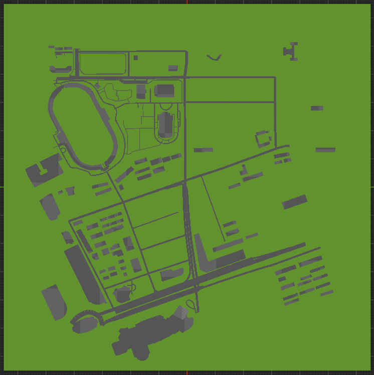

# PCG City Reconstruction Report

## 1. Overview

This project reconstructs a real urban area around Jiangwan Stadium using OpenStreetMap-derived data and Unreal Engine 5.7. The goal is to translate map geometry into a procedural city scene in `CityLevel`, including building footprints, building heights, roads, and a simple ground block.

The final implementation uses a PCG Graph as the main generation controller. The graph loads translated DataTables and spawns procedural Blueprint actors for buildings and roads. Each spawned actor then uses Blueprint logic and Geometry Script / Dynamic Mesh nodes to construct its own geometry. I also kept an earlier `BP_CityGenerator` prototype, which directly reads the normalized vertex DataTables and generates the whole area inside one Dynamic Mesh. The two approaches are described separately below because they consume the translated data differently.

Final deliverables include:

* `CityLevel`, the main level containing the generated area.
* `PCG_CityGraph`, the final PCG graph used for generation.
* `BP_PCG_Building` and `BP_PCG_Road`, procedural actors spawned by the PCG graph.
* `BP_CityGenerator`, an earlier Blueprint generator prototype.
* OSM-derived CSV/DataTable assets for buildings and roads.
* A side-by-side visual comparison between the OSM map and the generated result.
* `demo/demo.mp4`, a short fly-through and overhead demo video.

## 2. Source Area and OSM Data

The selected area is around Jiangwan Stadium in Shanghai. This area was chosen because it contains several visually distinctive structures and road patterns:

* The large oval Jiangwan Stadium footprint.
* A mix of large campus or public buildings and smaller rectangular building blocks.
* Several curved and straight road segments.
* Open spaces and a clear surrounding street grid.

The map can be found at <https://www.openstreetmap.org/#map=16/31.3065/121.515>

The source data was exported from OpenStreetMap and converted into UE-friendly CSV tables. Coordinates were translated into a local centimeter coordinate system so that they can be used directly in Unreal Engine, where one Unreal unit equals one centimeter.

The data translation pipeline outputs four main CSV tables:

* `buildings_meta`: one row per building, including `building_id`, height information, centroid data, number of vertices, OSM name, and a pre-grouped `footprint` string.
* `buildings_verts`: one row per building footprint vertex, including `building_id`, `vert_index`, `x_cm`, and `y_cm`.
* `roads_meta`: one row per road, including `road_id`, road type, width information, number of vertices, and a pre-grouped `centerline` string.
* `roads_verts`: one row per road centerline vertex, including `road_id`, `vert_index`, `x_cm`, and `y_cm`.

The normalized `*_verts` tables are useful for debugging and for the earlier Blueprint generator. The final PCG graph uses the `*_meta` tables because their `footprint` and `centerline` fields already contain the grouped geometry for each object.

## 3. Data Translation Pipeline

The Python translation pipeline converts OSM geometry into a format that Unreal Engine can import as DataTables.

For buildings, each polygon footprint is converted into local centimeter coordinates. The building metadata table stores one building per row, while the vertex table stores the same geometry in normalized vertex-row form. Building height is taken from available OSM height tags when possible. When height is missing, the pipeline assigns a reasonable fallback height so that the generated city still has visible 3D volume.

For roads, OSM way geometry is converted into centerline points. Each road is assigned a width in centimeters based on its OSM road category. The metadata table stores one road per row, while the vertex table stores each road centerline point separately.

The pipeline therefore produces both a normalized representation and a pre-grouped representation:

* The normalized representation, `buildings_verts` and `roads_verts`, is easier to inspect row by row and was used by the first Blueprint prototype.
* The pre-grouped representation, `footprint` in `buildings_meta` and `centerline` in `roads_meta`, is easier for the final PCG graph because the PCG graph can spawn one actor per row without performing complex group-by operations inside the graph.

## 4. Unreal Generation Design

### 4.1 Earlier Blueprint Prototype: `BP_CityGenerator`

Before building the final PCG graph version, I implemented a direct Blueprint generator called `BP_CityGenerator`. This actor owns a Dynamic Mesh Component and reads all four DataTables directly in its Construction Script.

The logic is:

1. Reset the target Dynamic Mesh.
2. Read `buildings_meta`.
3. For each building row, store the current `building_id` and `height_cm`.
4. Read `buildings_verts` and collect all vertices whose `building_id` matches the current building.
5. Add the collected footprint points into a temporary `Vector2D` array.
6. Use `Append Simple Extrude Polygon` to extrude the footprint into a 3D building.
7. Read `roads_meta`.
8. For each road row, store the current `road_id` and `width_cm`.
9. Read `roads_verts` and collect all centerline points whose `road_id` matches the current road.
10. Convert adjacent road points into rectangular road slabs using `Append Box`.

This version directly consumes the normalized vertex tables. It was useful for validating the correctness of the CSV import, DataTable structs, coordinate transformation, footprint reconstruction, and Dynamic Mesh generation. However, the graph became large because grouping vertices by id inside a Blueprint Construction Script requires nested loops.

### 4.2 Final PCG Graph Version: `PCG_CityGraph`

The final version uses `PCG_CityGraph` as the main generation entry point. The graph is assigned to a `PCGVolume` in `CityLevel`.

The final graph uses two main branches:

1. Building branch:

   * `Load Data Table(buildings_meta)`
   * `Spawn Actor(BP_PCG_Building)`

2. Road branch:

   * `Load Data Table(roads_meta)`
   * `Spawn Actor(BP_PCG_Road)`

Each row in `buildings_meta` becomes one spawned `BP_PCG_Building` actor. The PCG graph passes attributes such as `building_id`, `height_cm`, and `footprint` into the spawned actor.

Each row in `roads_meta` becomes one spawned `BP_PCG_Road` actor. The graph passes attributes such as `road_id`, `width_cm`, and `centerline` into the spawned actor.

This design keeps the high-level generation in PCG while keeping the detailed geometry construction in Blueprint. It also avoids doing complex vertex grouping inside the PCG graph because the Python pipeline already stores grouped geometry strings in the metadata tables.

### 4.3 `BP_PCG_Building`

`BP_PCG_Building` is spawned once per building row. It receives:

* `building_id`
* `height_cm`
* `footprint`

The `footprint` string contains semicolon-separated coordinate pairs. The actor parses this string into a `Vector2D` array, applies the final coordinate mapping for UE alignment, and uses Geometry Script / Dynamic Mesh nodes to extrude the footprint by `height_cm`.

The building geometry rule is:

* Parse all footprint points.
* Convert local map coordinates into UE coordinates.
* Build a closed polygon footprint.
* Extrude the polygon upward using `height_cm`.
* Cap the top face so the building appears as a solid block.

### 4.4 `BP_PCG_Road`

`BP_PCG_Road` is spawned once per road row. It receives:

* `road_id`
* `width_cm`
* `centerline`

The `centerline` string contains semicolon-separated coordinate pairs. The actor parses the centerline into points. For each adjacent point pair, it computes a road segment.

For each segment:

* Compute the midpoint.
* Compute the segment length.
* Compute the yaw angle using the direction from the first point to the second point.
* Append a thin box whose length follows the segment and whose width is `width_cm`.

This produces a road network made of connected flat slabs.

## 5. Coordinate Alignment

The source OSM map is north-up, while the UE Top view uses the Unreal world axes. During testing, the generated city initially appeared rotated relative to the OSM reference. To align the final PCG result with the OSM map orientation, the coordinate mapping was adjusted inside the generated building and road actors rather than rotating the generated actors manually.

The final coordinate conversion applies the local centimeter coordinates to UE space so that the top-down view matches the OSM reference. This is important because generated PCG actors should remain reproducible after pressing `Cleanup` and `Generate`; manually rotating generated actors would be overwritten by PCG regeneration.

## 6. Scene Composition

The final `CityLevel` contains:

* `Ground`: a large ground block covering the reconstructed area.
* `PCGVolume`: the actor that owns the PCG Component and references `PCG_CityGraph`.
* `PCGVolume_Generated`: the generated output folder containing spawned building and road actors.
* `PCGWorldActor0`: the PCG system actor created by Unreal Engine.
* Materials for buildings, roads, and ground.

The generated result can be reproduced by selecting `PCGVolume` and pressing `Cleanup` followed by `Generate`.

## 7. Visual Result and Fidelity

The generated area preserves the main spatial structure of the OSM source. The most recognizable element is the oval Jiangwan Stadium, which appears in the correct relative location and shape. Large surrounding building blocks and the road network are also reconstructed from the translated OSM geometry.

The generated scene is not intended to be a photorealistic model. Instead, it focuses on geometric fidelity:

* Building footprints match the OSM polygon outlines.
* Building heights are represented as simple extrusions.
* Roads follow the OSM centerlines.
* Road widths are approximated from OSM road categories.
* The generated scene is procedurally reproducible from the translated tables.

Side-by-side comparison:

| OSM reference              | Generated UE / PCG result  |
| -------------------------- | -------------------------- |
|  |  |

## 8. Demo Video

The demo video is stored at:

```text
demo/demo.mp4
```

## 9. How to Reproduce

To regenerate the scene:

1. Open the Unreal project.
2. Open `Content/Maps/CityLevel`.
3. Select `PCGVolume` in the World Outliner.
4. Confirm that its PCG graph is set to `PCG_CityGraph`.
5. Press `Cleanup` to remove old generated actors.
6. Press `Generate` to rebuild the city.
7. The generated actors should appear under `PCGVolume_Generated`.

To rerun the data pipeline:

1. Run the OSM-to-CSV conversion script.
2. Reimport the generated CSV files into Unreal as DataTables using the matching Struct assets.
3. Open `CityLevel`.
4. Regenerate the PCG graph.

## 10. Known Limitations

This project prioritizes procedural reconstruction and geometric correspondence rather than visual realism. Some limitations remain:

* Some buildings seems to be missing. I've confirmed that they are missing in the OSM data in the first place.
* Roads are represented as flat rectangular slabs between adjacent centerline points, so complex intersections are simplified.
* Terrain elevation is not reconstructed; the city is built on a flat ground block.
* Materials are simple and used mainly to distinguish buildings, roads, and ground.
* The final PCG graph uses `buildings_meta` and `roads_meta` because these tables contain pre-grouped geometry strings. The normalized `buildings_verts` and `roads_verts` tables remain part of the pipeline output and were used for validation and the earlier `BP_CityGenerator` implementation.